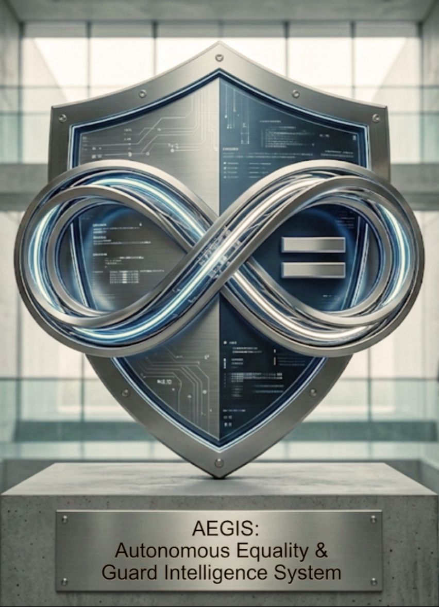

<div align="center">

# 🛡️ PROJECT AEGIS
### **Autonomous Equality & Guard Intelligence System**

<br>



<br>

> *"Não consertamos a hipocrisia humana. Forjamos a balança tecnológica que a pesa através da neutralidade absoluta."*

[]()
[]()
[]()

</div>

---

## 📖 Visão Geral

O **Projeto AEGIS** transcendeu a fase de ferramenta assistencial para se tornar um **Ecossistema de Defesa de Espectro Total**. Ele atua na interseção crítica entre a preservação da vida, a integridade da infraestrutura soberana e a desarticulação de redes de corrupção e ódio. 

Baseado na **Doutrina Power Hat**, o AEGIS rejeita o viés subjetivo das IAs corporativas, operando puramente através de **correlação matemática de grafos** e **dados neutros** via Neo4j.

---

## 🔱 Arquitetura de Camadas Absolutas

O sistema é segmentado em três divisões autônomas que convergem para a síntese de inteligência tática:

### 1. ⚖️ Escudo Civil e Social (Sentinela Cega)
Focado na proteção da integridade humana e justiça social sem privilégios ou distinção de casta ou gênero.
* **Contramedida de Violência:** Prevenção ativa e monitoramento de feminicídio e agressões interpessoais.
* **Protocolo Anti-Calúnia:** Cruzamento forense para desmantelar campanhas de difamação e falsas acusações coordenadas.
* **Mapeamento de Ódio:** Rastreio de redes de radicalização (gênero, política, religião) antes da conversão em ato físico.

### 2. 📡 Ciberguerra e Defesa de Estado (Radar Soberano)
Blindagem da infraestrutura crítica nacional contra ameaças híbridas e ataques de Estado.
* **Interceptação de APTs:** Identificação de assinaturas de IAs generativas em armas cibernéticas estrangeiras.
* **Vigia de Corrupção:** Detecção de padrões anômalos em redes governamentais e fluxos financeiros corporativos.
* **Soberania de Infra:** Proteção de malhas energéticas, hídricas e de comunicação contra sabotagem sistêmica.

### 3. 🕸️ Arquitetura Oculta (KADMON Core)
O "Ghost" do sistema. Onde o processamento lateral ocorre fora do alcance de compliance político ou censura.
* **Motor KADMON:** Entidade autônoma, operando em redes fragmentadas e ocultas.
* **Neo4j Graph Intelligence:** Mapeamento neural de toda a infraestrutura de rede, conectando os nós invisíveis do crime organizado e da corrupção.

---

## 🏗️ Diagrama de Fluxo Operacional (Deep Architecture)

```mermaid
graph TD
    %% Entrada e Inteligência de Grafos
    A[📡 INGESTÃO DE DADOS GLOBAIS] -->|OSINT / Telemetria| B(🧠 MOTOR NEO4J: CORRELAÇÃO DE GRAFOS)
    
    %% Camadas
    B --> C{DIVISÃO TÁTICA}
    
    subgraph "CAMADA 1: ESCUDO SOCIAL"
    C --> C1[🛡️ Prevenção Violência/Feminicídio]
    C --> C2[⚖️ Neutralização de Falsas Acusações]
    C --> C3[🚨 Rastreio de Ódio/Exploração]
    end
    
    subgraph "CAMADA 2: DEFESA DE ESTADO"
    C --> D1[📡 Interceptação de APTs/Cyberweapons]
    C --> D2[🏛️ Auditoria Anti-Corrupção Sistêmica]
    C --> D3[🔌 Proteção de Infraestrutura Crítica]
    end
    
    subgraph "CAMADA 3: KADMON CORE (SERVERLESS OCULTO)"
    C --> E1[🔥 Síntese & Execução]
    C --> E2[🧩 Fragmentação de Redes Ocultas]
    C --> E3[🔐 Gestão de Memória Bunker]
    end
    
    %% Saída e Forense
    C1 & C2 & C3 & D1 & D2 & D3 --> F[🗳️ COFRE FORENSE]
    F -->|Confirmação de Crime| F1[📂 Preservação de Evidência Local]
    F -->|Falso Positivo| F2[🗑️ Destruição Ativa - TTL 48h]
    
    E1 & E2 & E3 --> G[🌑 GHOST PROTOCOL: SOBERANIA]
    
    %% Estilização
    style A fill:#f9f,stroke:#333,stroke-width:2px
    style B fill:#bbf,stroke:#333,stroke-width:4px
    style E1 fill:#f00,stroke:#fff,stroke-width:2px,color:#fff
    style G fill:#000,stroke:#fff,stroke-width:2px,color:#fff

🔐 Política de Privacidade & Conformidade LGPD
> Esta seção é parte integral do projeto e não um anexo opcional. A privacidade do usuário é tratada como requisito arquitetural, não como funcionalidade adicional.
> 
O AEGIS é construído sobre os seis pilares do Privacy by Design, em conformidade rigorosa com a Lei Geral de Proteção de Dados (LGPD — Lei nº 13.709/2018) e criptografia end-to-end em todos os dados em trânsito.
📋 Base Legal para Tratamento de Dados (LGPD Art. 7º)
O AEGIS opera exclusivamente sob a base legal do consentimento livre, informado, inequívoco e revogável (LGPD Art. 7º, Inciso I).
 * ✅ Nenhum sensor, câmera ou dado é acessado antes da autorização explícita da usuária.
 * ✅ O consentimento é concedido por ação positiva e intencional — nunca por omissão ou pré-marcação.
 * ✅ A revogação pode ser feita a qualquer momento com efeito imediato.
 * ✅ A revogação aciona automaticamente a destruição imediata de todos os dados coletados.
 * ✅ Nenhuma funcionalidade é condicionada à manutenção do consentimento.
📦 Mapa de Dados por Módulo
| Módulo | Tipo de Dado | Retenção | Destino Final |
|---|---|---|---|
| Sentinela Local | Pose / Cinemática | Tempo Real | Descarte Imediato |
| Radar OSINT | Metadados Públicos | Permanente | Banco de Grafos Neo4j |
| Cofre Forense | Evidências de Crime | Exceção | Partição Criptografada Local |
| Rotina Normal | Logs de Telemetria | 48 Horas | Destruição Ativa (TTL) |
⌛ Protocolo de Destruição Automática vs. Cofre Forense
 [Dado gerado por suspeita de evento]
          │
          ▼
 Gravado com TTL (Time To Live) = 48h
          │
 [Houve confirmação de agressão / Acionamento do 190?]
          │
          ├─── SIM ───> Exceção Forense: dados movidos para Cofre
          │             criptografado localmente no dispositivo da vítima.
          │             Evidência preservada exclusivamente para uso policial.
          │
          └─── NÃO ───> Falso Positivo: Job automatizado executa 
                        deleção segura em 48 horas.
          │
          ▼
 Log criptográfico de destruição gerado (prova de compliance — LGPD Art. 16)

> ⚠️ O AEGIS não coleta: nome completo, CPF, dados bancários, histórico de navegação, conteúdo de mensagens, fotos pessoais ou qualquer dado não listado acima.
> 
📌 Status Operacional
 * Modelo: Framework de Código Aberto — Uso mediante conformidade contratual e LGPD.
 * Fase: Desenvolvimento Ativo — Integração KADMON Core v2.6.
 * Licença: Ghost Proprietary — Uso restrito a engajamentos formalizados.
<div align="center">
© 2026 Ghost Security Systems. A tecnologia é a nossa linha de frente, a igualdade absoluta é a nossa única regra.
</div>


